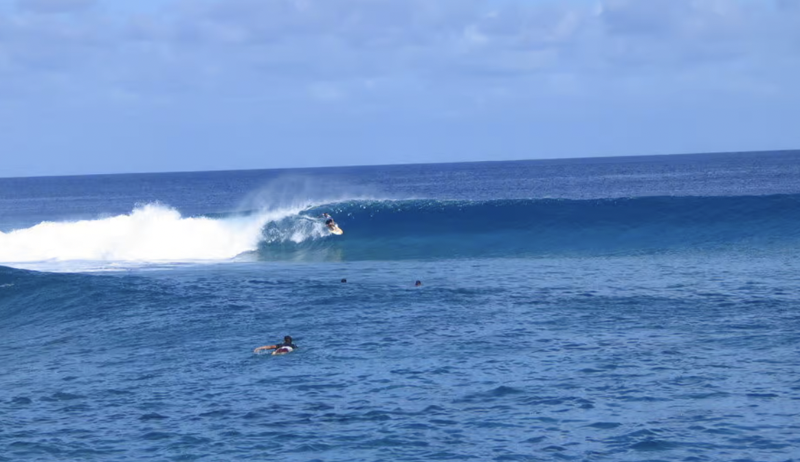

# Hello, I'm Kyle :wave:
<hr>


> Hello, I'm Paul!


## About

**I have one brother and _three_ dogs**.

***I'm originally from San Deigo.***

### Things I enjoy:
Being outside/hiking, traveling, the beach/surfing, programming, reading, soccer.
<sup>*Hopefully this list will continue to grow as I enjoy learning new things</sup>

This is an image of my favorite surf break:


<hr>


### Education
- **Major:** Computer Engineering
- **Year:** Junior
- **College:** ERC
<hr>
<br>

~~Favorite Programming Language: ` MATLAB`~~

Favorite Programming Language: ` Vimscript` :black_joker:	

```vim
set belloff=all
colorscheme tokyonight

map <C-P> :bp<cr>
map <C-N> :pn<cr>

nmap ,f :ClangFormat<cr>
```
*Beautiful.*
<sub>Is vimscript turing complete?</sub>

<hr>

### Travel to all National Parks in California
- [x] Yosemite
- [x] Sequoia 
- [x] Redwoods
- [ ] Death Valley
- [ ] Joshua Tree
- [ ] Lassen Volcanic
- [x] Zion
- [ ] Death Valley
- [x] Channel Islands
- [x] Kings Canyon

<hr>

### Where you are likely to find me on campus
1. Franklin Antonio Hall
2. CSE Building
3. ECE tutoring center
4. DIB or Envision
5. Biomed library
6. Getting coffee

<hr>

### Things I hope to start learning this summer
- More about data visualization, `ThreeJS`, `WebGPU`
 - Building high performance servers, and zero-copy networking
 - Learn a new systems language, either [Rust](https://www.rust-lang.org/) or [Zig](https://ziglang.org/)
 - Local-first software
- jiu jitsu
- French